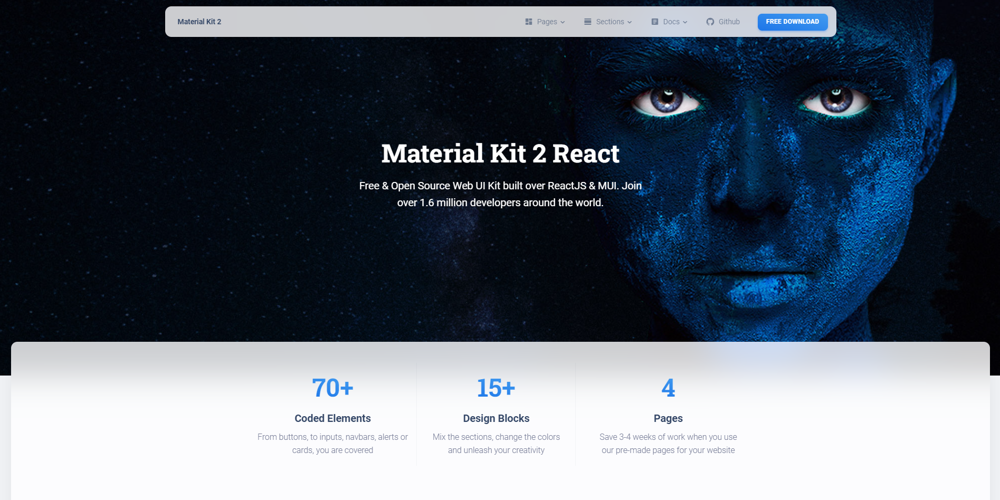

# my-react-app-abc

```my-react-app-abc``` is a sample project, intended to demonstrate the problem of linking a local NodeJS project as a dependency. The problem arises from the fact that the project is not yet published in NPM, thus cannot be used as a standard NPM dependency out-of-the-box. 

This project demonstrates inclusion of the React UI component, available here https://github.com/epanikas/material-kit-react

See the following blog article, describing in details the problem and solution:
- part 1: https://epanikas.hashnode.dev/react-lib-how-to-include-a-local-react-ui-library-component-into-a-react-app-part-1-of-2
- part 2: https://epanikas.hashnode.dev/react-lib-how-to-include-a-local-react-ui-library-component-into-a-react-app-part-2-of-2


# How to use this repository

create the following directory structure:
- create folder ```workspace``` (or choose any other name) and cd into it
- once in ```workspace```
    - clone the repo https://github.com/epanikas/my-react-app-abc
    - clone the repo https://github.com/epanikas/material-kit-react

you should end up with the following file structure

```
└── workspace
    ├── my-react-app-abc
    └── material-kit-react
```

Now run ```npm install``` both in ```material-kit-react``` and in ```my-react-app-abc```.

Once the ```npm install``` has been executed, run
- in material-kit-react
    - **npm run build-module**
- in my-react-app-abc
    - **npm run dev**

This will start the dev server on the port 9000, and, if everything works as intended, you should see the following page on the browser:




# Versions
The following versions have been used:

| component  | version  |
|------------|----------------|
| NodeJS version | **18.16.0** |
| NPM version | **9.6.5** |
| React version | **18.2.0** |
| Webpack version | **5.89.0** |


# NOTE

Note, that ```my-react-app-abc``` will have the link to ```material-kit-react``` as follows (in ```package.json```):

```json
{
  "name": "my-react-app-abc",
  "version": "1.0.0",
  "private": true,
  ...
  "dependencies": {
    ...
    "material-kit-2-react": "file:../material-kit-react",
    ...
  },
  ...

}
```

hence the positioning of the folders relative to each other is very important.

Note, during the work on the project on numerous occasions I have encountered the refresh problem, when modifications, done in config, are not directly reflected in the browser, even with hot-reload activated. Hence,
> Don't forget to **recompile the bundle** (in material-kit-react), **restart the dev-server** (in my-react-app-abc) and **use the hard-reload option** in browser.

